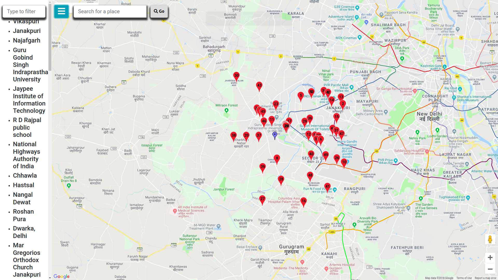
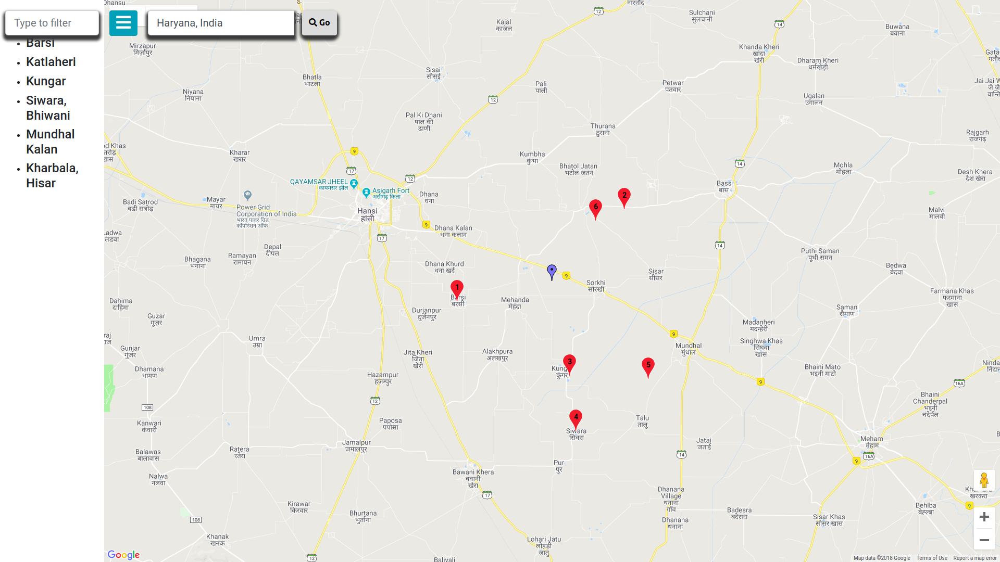
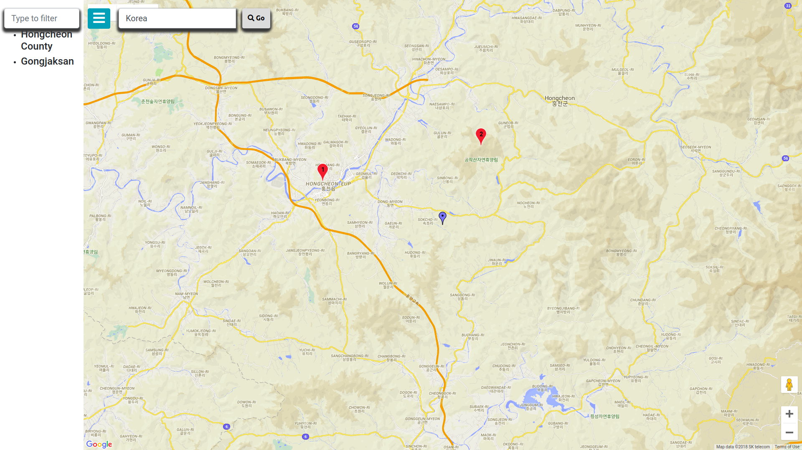
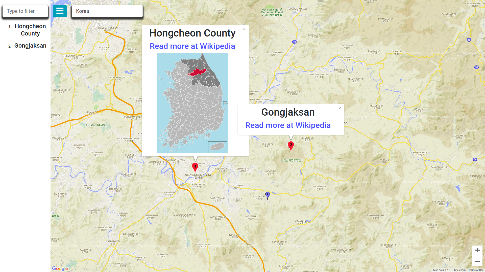
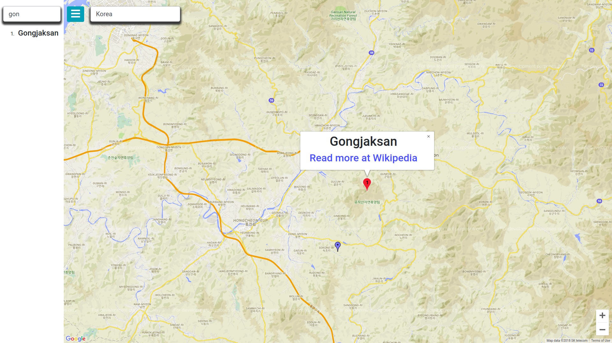
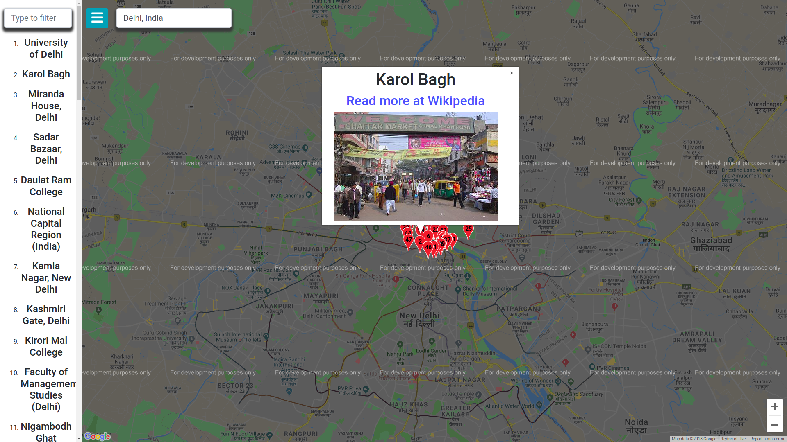

# Nakp = (Naksha + Map)

## Demo 

Demo is available here [https://jatindhankhar.in/nakp](https://jatindhankhar.in/nakp)

## Technologies Used
* React
* ReactStrap (Bootstrap components for React)
* CORS Anywhere (To Bypass Wikimedia's API Cors limitation)
* WikiMedia API
* Google Maps V3 Js SDK

## How to it looks

 
 
 
 
 

## How to Run it 

#### Development 

1. Clone the repo
2. Go to the directory
3. Run it with `npm start`
4. Hack! :octocat: :computer:

#### Production Build
1. Clone the repo
2. Go to the directory
3. Run it with `npm run build`
